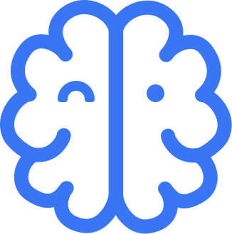

<p align="center">
  
</p>

# 🧠 NeuroSpot – Plataforma interactiva para la detección temprana de TDAH infantil
<br>

## 📝 Descripción del proyecto

**NeuroSpot** es una solución digital basada en inteligencia artificial y servicios de AWS que ayuda a detectar posibles indicadores de TDAH en niños mediante juegos cognitivos breves. A través de una interfaz web atractiva e interactiva, el sistema recopila datos de voz, imagen y rendimiento cognitivo para analizarlos con herramientas de machine learning en la nube.

> ⚠️ Este sistema no sustituye el diagnóstico clínico, pero actúa como herramienta preventiva y de apoyo a familias y profesionales.

---

<br>

## 🎯 Objetivo académico

Este proyecto se enmarca en la práctica de la asignatura **Inteligencia Artificial – Seminario de Machine Learning con AWS**. La finalidad es diseñar e implementar un sistema funcional que utilice al menos un servicio de Machine Learning de AWS como componente central, integrando a su vez otros servicios del ecosistema AWS.

<br>

---

<br>

## 🧩 Funcionalidades principales

- Registro seguro de tutores y consentimiento informado
- Ejecución secuencial de juegos cognitivos:
  - Test de Stroop
  - Lectura en voz alta
  - Atención continua
  - Memoria visual
  - Observación visual
  - Análisis de emociones faciales
- Generación de un informe con resultados individuales
- Integración completa con servicios de AWS para procesar datos en la nube

<br>

---

<br>

## 🧠 Arquitectura técnica (resumen)

| Componente                  | Servicio AWS                      | Descripción                                                                 |
|----------------------------|-----------------------------------|-----------------------------------------------------------------------------|
| Frontend                   | S3 + CloudFront                   | Hosting del frontend Next.js estático con entrega global segura            |
| Autenticación (futuro)     | Amazon Cognito                    | Gestión de usuarios y sesiones (previsto)                                  |
| Almacenamiento             | Amazon S3                         | Guarda audios, imágenes, fotogramas, resultados                            |
| Lógica de negocio          | AWS Lambda                        | Orquestación sin servidor entre servicios                                  |
| Base de datos              | Amazon DynamoDB                   | Almacenamiento estructurado de sesiones y métricas de juego                |
| Análisis de voz            | Amazon Transcribe + Comprehend    | Transcripción y análisis semántico del discurso leído                      |
| Análisis de emociones      | Amazon Rekognition                | Identificación de emociones faciales a partir de imágenes capturadas       |
| Visualización (futuro)     | Amazon QuickSight                 | Generación automática de dashboards de resultados (previsto)               |
| Monitorización             | Amazon CloudWatch                 | Logs y trazabilidad del sistema                                            |

<br>

---

<br>

## 🚀 Despliegue local

1. Clona el repositorio:
   ```bash
   git clone https://github.com/vjrivmon/NeuroSpot.git
   cd NeuroSpot
   ```

2. Instala las dependencias:
   ```bash
   npm install ```

3. Inicia la aplicación en local:
   ```bash
   npm run dev ```

4. Inicia la web con el archivo automático:
   ```bash
   ./start_neurospot.sh ```

> Nota: para ejecutar funciones AWS debes tener configuradas las credenciales y permisos adecuados en tu entorno local. Las llamadas a Lambda están gestionadas desde el frontend.

---

<br>

## 📹 Vídeo demostración
🎥 Ver demostración del sistema (5 min)
En el vídeo se explica el funcionamiento general, los flujos cognitivos, decisiones técnicas, y qué herramientas se han utilizado como Cursor y ChatGPT para inspiración, lógica y documentación técnica y los servicios de AWS.

<br>

---

<br>

## 📄 Informe entregado
El informe está disponible en el repositorio como NeuroSpot.pdf e incluye:
- Caso de uso y contexto social
- Diagrama arquitectónico profesional
- Descripción técnica de cada componente
- Uso de servicios de AWS detallado

  <br>
  
---

<br>

## 🤖 Tecnologías utilizadas
- Next.js + Tailwind CSS + Shadcn/ui
- Node.js + AWS SDK v3
- Amazon S3, CloudFront, Lambda, DynamoDB, Amazon Rekognition, Transcribe, Comprehend
- Cursor, V0, ChatGPT

<br>

 ---
 
 <br>

## 👩‍🏫 Autores
Irene Medina García - Vicente Rivas Monferrer 

[](https://github.com/irenemg8) - [](https://www.linkedin.com/in/irene-medina-garcia/) - [](https://github.com/vjrivmon) - [](https://www.linkedin.com/in/vicente-rivas-monferrer/)
